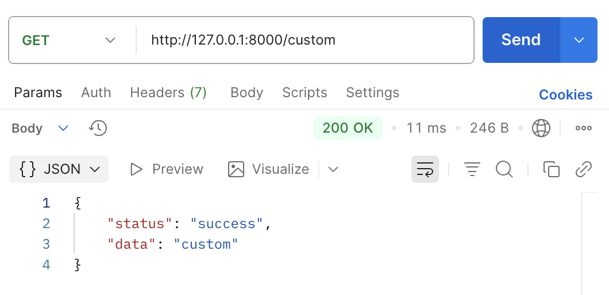
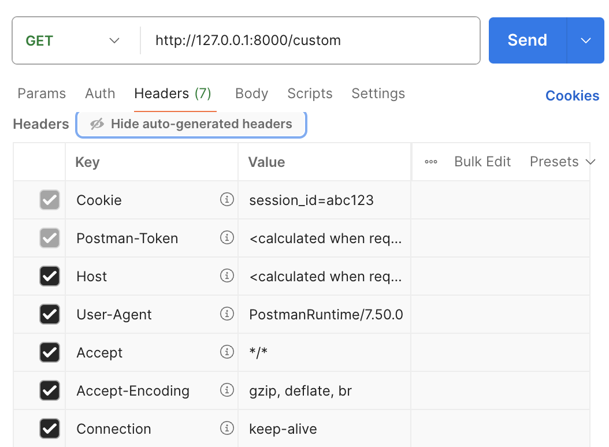
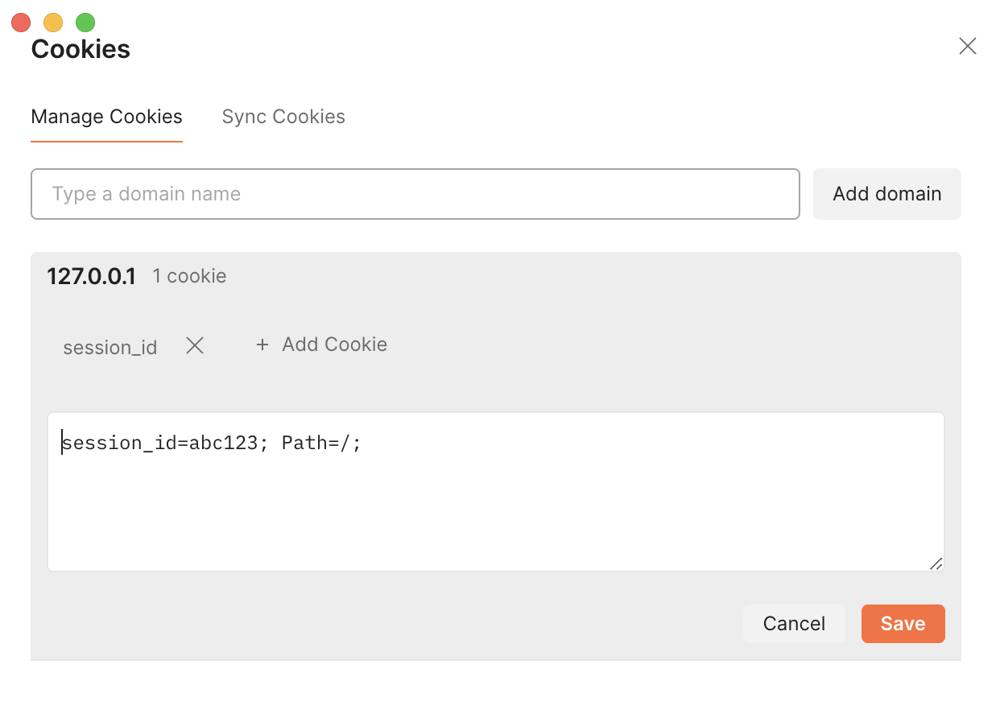
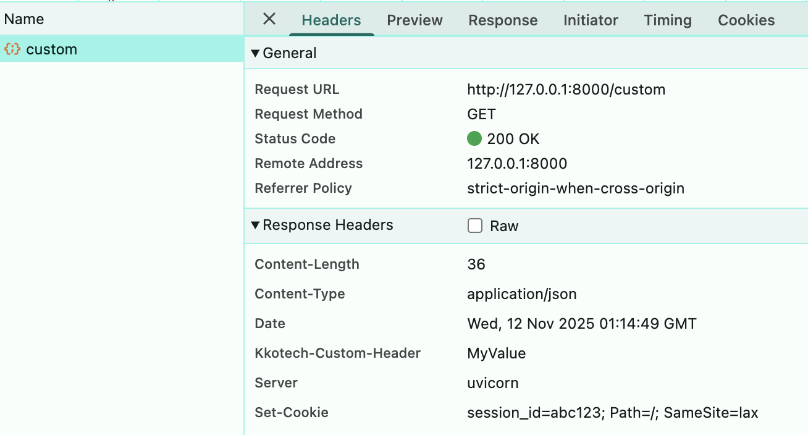

# Community Backend - FastAPI Learning Project

> FastAPI를 활용한 커뮤니티 백엔드 API 개발 학습 프로젝트  
> FE Repository: [ktb3-yanni-community-fe](https://github.com/yanwoo8/ktb3-yanni-community-fe)


[](https://www.python.org/)
[](https://fastapi.tiangolo.com/)

[](https://www.postman.com/)
[](https://curl.se/docs/manpage.html)

[](https://kakaotechbootcamp.com/)
[](https://www.startupcode.kr/)


## Table of Contents

[1. FastAPI 프로젝트 초기 설정 및 HTTP 기초](#1-fastapi-프로젝트-초기-설정-및-http-기초)
- [1-1. 설명](#1-1-설명)
- [1-2. 결과](#1-2-결과)
- [1-3. 문제](#1-3-문제)
- [1-4. 해결](#1-4-해결)

[2. HTTP 메서드 및 요청 처리 - RESTful CRUD 구현](#2-http-메서드-및-요청-처리---restful-crud-구현)
- [2-1. 설명](#2-1-설명)
- [2-2. 결과](#2-2-결과)
- [2-3. 문제와 해결](#2-3-문제와-해결)

[3. 아키텍처 리팩토링 (Route-Controller 분리)](#3-아키텍처-리팩토링-route-controller-분리)
- [3-1. 설명](#3-1-설명)
- [3-2. 결과](#3-2-결과)
- [3-3. 문제 및 해결](#3-3-문제와-해결)

[4. 설계서 기반 백엔드 기능 구현](#4-설계서-기반-백엔드-기능-구현)
- [4-1. 설명](#4-1-설명)
- [4-2. 결과](#4-2-결과)

[5. 아키텍처 리팩토링 (Route-Controller-Model 구조)](#5-아키텍처-리팩토링-route-controller-model-구조)
- [5-1. 설명](#5-1-설명)
- [5-2. 결과](#5-2-결과)
- [5-3. 문제 및 해결](#5-3-문제-및-해결)

[6. 데이터베이스 통합 (SQLite + SQLAlchemy)](#6-데이터베이스-통합-sqlite--sqlalchemy)
- [6-1. 설명](#6-1-설명)
- [6-2. 결과](#6-2-결과)
- [6-3. 문제 및 해결](#6-3-문제-및-해결)

[7. AI 모델 서빙 - 자동 댓글 생성](#7-ai-모델-서빙---자동-댓글-생성)
- [7-1. 설명](#7-1-설명)
- [7-2. 결과](#7-2-결과)
- [7-3. 문제 및 해결](#7-3-문제-및-해결)

[8. 프론트엔드 구현](#8-프론트엔드-구현)

---


## 1. FastAPI 프로젝트 초기 설정 및 HTTP 기초

### 1-1. 설명

**branch name:** `feature/init-setup`  
**구현 내용:**
1. `pyproject.toml`: 의존성, 프로젝트 메타데이터 정리 및 이해
2. `main.py`: FastAPI의 기본 구조 작성 - 엔드포인트 이해 및 데코레이터 활용법 학습
3. `main.py`: HTTP Response의 3요소 구현 - Status Code, Headers, Body
4. `main.py`: JSON 직렬화 - Python dict → JSON string, `JSONResponse`
5. `main.py`: Cookie를 통한 상태 관리 - HTTP의 Stateless 문제 및 쿠키 활용 이해

**검증:** Postman으로 `GET` 요청 후  Status Code, Headers, Cookie 확인


### 1-2. 결과
<details>
<summary>직접 테스트해보기</summary>

```sh
uvicorn main:app --reload
```
> - API 문서: http://localhost:8000/docs
> - Health Check: http://localhost:8000/
> - 커스텀 응답: http://localhost:8000/custom
</details>

<details>
<summary>1. <code>GET /</code></summary>


</details>
    
<details>
<summary>2. <code>GET /custom</code></summary>


</details>


### 1-3. 문제

<details>
<summary>1. Postman에서 Header를 찾을 수 없음.</summary>

</details>
<details>
<summary>2. Postman에서 Cookie setting을 모두 확인할 수 없음.</summary>

</details>
    


### 1-4. 해결

<details>
<summary>1. `curl` 사용</summary>

- 요청: `curl -v http://localhost:8000/custom`
- 터미널 출력:
    ```zsh
    * Host localhost:8000 was resolved.
    * IPv6: ::1
    * IPv4: 127.0.0.1
    * Trying 127.0.0.1:8000...
    * Connected to localhost (127.0.0.1) port 8000
    > GET /custom HTTP/1.1
    > Host: localhost:8000
    > User-Agent: curl/8.7.1
    > Accept: */*
    > 
    * Request completely sent off
    < HTTP/1.1 200 OK
    < date: Wed, 12 Nov 2025 01:11:25 GMT
    < server: uvicorn
    < kkotech-custom-header: MyValue
    < content-length: 36
    < content-type: application/json
    < set-cookie: session_id=abc123; Path=/; SameSite=lax
    < 
    * Connection #0 to host localhost left intact
    {"status":"success","data":"custom"}%
    ```
</details>
<details>
<summary>2. Developer Tools - Network</summary>

browser ➡️ Developer Tools ➡️ Network

</details>


---


## 2. HTTP 메서드 및 요청 처리 - RESTful CRUD 구현

### 2-1. 설명

**branch name:** `feature/http-methods`  
**구현 내용:**  
`main.py` - REST API의 CRUD 연산을 HTTP 메서드에 매핑
1. `Pydantic` 모델 정의 - Request Body 검증(필수/선택) 및 직렬화 (PostCreate, PostPartialUpdate)
2. `POST /posts` - 게시글 생성: 자동 ID 할당, in-memory 저장소
3. `GET /posts`, `GET /posts/{post_id}` - 게시글 조회: Read Collection/Single, Path Parameter
4. `PUT /posts/{post_id}` - 게시글 전체 교체: Idempotent, Update - Full
5. `PATCH /posts/{post_id}` - 게시글 부분 수정: `exclude_unset`
6. `DELETE /posts/{post_id}` - 게시글 삭제: 204 No Content
7. `main.py`: HTTP Status Code 활용 - 200/201/204/404 응답 처리

**검증:** Postman 또는 curl로 5개 HTTP 메서드 테스트


### 2-2. 결과

<details>
<summary>직접 테스트해보기</summary>

```sh
uvicorn main:app #--reload
```
- API 문서: http://localhost:8000/docs
- Health Check: http://localhost:8000/
- 커스텀 응답: http://localhost:8000/custom
- 게시글 목록: http://localhost:8000/posts
```sh
# POST: Create
curl -X POST http://localhost:8000/posts \
-H "Content-Type: application/json" \
-d '{"title":"Test","content":"Hello"}'

# GET: Read all
curl -X GET http://localhost:8000/posts

# GET: Read one
curl -X GET http://localhost:8000/posts/1
curl -X GET http://localhost:8000/posts/999

# PUT
curl -X PUT http://localhost:8000/posts/1 \
-H "Content-Type: application/json" \
-d '{"title":"Updated","content":"World"}'

# PATCH
curl -X PATCH http://localhost:8000/posts/1 \
-H "Content-Type: application/json" \
-d '{"title":"Patched"}'

# DELETE
curl -X DELETE http://localhost:8000/posts/1
curl -i -X DELETE http://localhost:8000/posts/999

# GET: Read all
curl -X PUT http://localhost:8000/posts

# GET: Read one
curl -X PUT http://localhost:8000/posts/1
```
</details>

<details>
<summary>1. <code>POST /posts</code> 게시글 생성</summary>

**요청:**
```sh
curl -X POST http://localhost:8000/posts \
  -H "Content-Type: application/json" \
  -d '{"title":"FastAPI 학습","content":"REST API CRUD 구현 완료"}'
```

**응답 (Status 201 Created):**
```json
{
    "message": "Created",
    "data": {
        "id": 1,
        "title": "FastAPI 학습",
        "content": "REST API CRUD 구현 완료"
    }
}
```
</details>


<details>
<summary>2. <code>GET /posts</code> 전체 게시글 조회</summary>

**요청:**
```sh
curl -X GET http://localhost:8000/posts
```

**응답 (Status 200 OK):**
```json
{
    "message": "Success",
    "count": 1,
    "data": [
        {
            "id": 1,
            "title": "FastAPI 학습",
            "content": "REST API CRUD 구현 완료"
        }
    ]
}
```
</details>

<details>
<summary>3. <code>GET /posts/{post_id}</code> 특정 게시글 조회</summary>

**요청:**
```sh
curl -X GET http://localhost:8000/posts/1
curl -X GET http://localhost:8000/posts/999
```

**응답 (Status 200 OK):**
```json
{
    "message": "Success",
    "data": {
        "id": 1,
        "title": "FastAPI 학습",
        "content": "REST API CRUD 구현 완료"
    }
}
```

**존재하지 않는 ID 요청 시 (Status 404 Not Found):**
```json
{
    "error": "Not found",
    "message": "Post with id 999 does not exist"
}
```
</details>

<details>
<summary>4. <code>PUT /posts/{post_id}</code> 게시글 전체 수정</summary>

**요청:**
```sh
curl -X PUT http://localhost:8000/posts/1 \
  -H "Content-Type: application/json" \
  -d '{"title":"수정된 제목","content":"수정된 내용입니다"}'
```

**응답 (Status 200 OK):**
```json
{
    "message": "Updated",
    "data": {
        "id": 1,
        "title": "수정된 제목",
        "content": "수정된 내용입니다"
    }
}
```
</details>

<details>
<summary>5. <code>PATCH /posts/{post_id}</code> 게시글 부분 수정</summary>

**요청 (제목만 수정):**
```sh
curl -X PATCH http://localhost:8000/posts/1 \
  -H "Content-Type: application/json" \
  -d '{"title":"부분 수정된 제목"}'
```

**응답 (Status 200 OK):**
```json
{
    "message": "Partially updated",
    "data": {
        "id": 1,
        "title": "부분 수정된 제목",
        "content": "수정된 내용입니다"
    }
}
```
> **Note**: `content` 필드는 이전 값 유지
</details>

<details>
<summary>6. <code>DELETE /posts/{post_id}</code> 게시글 삭제</summary>

**요청:**
```sh
curl -i -X DELETE http://localhost:8000/posts/1
curl -i -X DELETE http://localhost:8000/posts/999
```

**응답 (Status 204 No Content):**
```sh
HTTP/1.1 204 No Content # 응답 본문 없음
date: # 실행한 날짜 출력
server: uvicorn
content-type: application/json
```

**이미 삭제된/없는 ID 요청 시 (Status 404 Not Found):**
```sh
HTTP/1.1 404 Not Found
date: # 실행한 날짜 출력
server: uvicorn
content-length: 65
content-type: application/json
{
  "error": "Not found",
  "message": "Post with id 999 does not exist"
}
```
**이후 Read all (`GET /posts`) 요청 시:**
```json
{
    "message": "Success",
    "count": 0,
    "data": []
}
```

**이후 Read all (`GET /posts/1`) 요청 시:**
```json
{
    "error": "Not found",
    "message": "Post with id 1 does not exist"
}
```
</details>


### 2-3. 문제와 해결

<details>
<summary>1. PATCH 작성 시 None으로 덮어씌워짐</summary>

**문제 상황:**
- `Pydantic BaseModel` & `Optional` 사용으로 `None`값 제외가 보장되는 것으로 착각함
- `PATCH` (부분 수정) 요청 시 전송하지 않은 필드가 `None`으로 덮어씌워지는 문제 발생

- **요청:** `PATCH .../posts/1 {"title":"Patched"}`
- **응답:**
    ```json
    {
        "message": "Partially updated", // failed: content가 None으로 덮어씌워짐.
        "data": {"id":1, "title":"Patched", "content":null}
    }
    ```

**원인:**
```python
@app.patch("/posts/{post_id}")
def partial_update(post_id: int, update_data: PostPartialUpdate) -> JSONResponse:
    # ... 업데이트 로직 ...
    update_dict = update_data.model_dump()
    posts[i].update(update_dict)
    # ... 업데이트 로직 ...
```

**해결: PATCH 구현 시 `exclude_unset` 활용**
```py
update_dict = update_data.model_dump(exclude_unset=True)
```
</details>

<details>
<summary>2. DELETE 시 출력 없음</summary>

**문제 상황:** 삭제 성공 시 JSON 응답을 반환했더니 **응답 본문이 전혀 표시되지 않음**

**원인:**
```python
@app.delete("/posts/{post_id}", status_code=204)
def delete_post(post_id: int):
    # ... 삭제 로직 ...
    return JSONResponse(status_code=204,
            content={"message": f"Post with id {post_id} deleted"})
```

**해결: 삭제 성공 시 `return None` (또는 빈 반환)**
```py
return None
```
- HTTP 표준에 따르면 DELETE 엔드포인트 204 No Content는 본문이 없어야 함
- FastAPI가 자동으로 204 No Content 처리
- 이때 OpenAPI 자동 문서화를 명확히 하려면 `status_code=204`를 데코레이터로 명시해야 함

</details>


---

## 3. 아키텍처 리팩토링 (Route-Controller 분리)

### 3-1. 설명

**branch name:** `feature/architecture-refactor`  
**구현 내용:**  
Route - Controller 분리 & SOC, SRP, DIP 보장
- **관심사의 분리(SoC/Separation of Concerns)**: Route(HTTP), Controller(비즈니스 로직), Schema(검증) 분리
- **단일 책임 원칙(SRP/Single Responsibility Principle)**: 각 계층이 하나의 책임만 담당
- **의존성 역전 원칙(DIP/Dependency Inversion Principle)**: Route → Controller 의존, 역방향 의존 없음
```
app/
├── main.py              # 앱 진입점, Router 등록
├── routes/              # HTTP 계층
│   └── post_routes.py   # 엔드포인트 정의
├── controllers/         # 비즈니스 로직 계층
│   └── post_controller.py  # CRUD 로직
└── schemas/             # 데이터 검증 계층
    └── post_schema.py   # Pydantic 모델
```

|      -     |        관심사/Concerns         |   의존성 방향   | 책임/Responsibility |
|------------|------------------------------|--------------|--------------------|
| Route      | HTTP 요청/응답 처리, 상태 코드 매핑 | → Controller | HTTP 스펙 변경 시 수정 |
| Controller | 비즈니스 로직, 데이터 검증         | → None       | 비즈니스 규칙 변경 시 수정 |
| Schema     | Pydantic 모델을 통한 타입 검증    |      -       | 데이터 구조 변경 시 수정 |


**검증:** 기존 CRUD 기능이 동일하게 동작하는지 확인


### 3-2. 결과
curl로 확인한 결과, 모두 정상적으로 작동하였다.
<details>
<summary>직접 테스트해보기</summary>

```sh
uvicorn main:app #--reload
```
- API 문서: http://localhost:8000/docs
- Health Check: http://localhost:8000/
- 커스텀 응답: http://localhost:8000/custom
- 게시글 목록: http://localhost:8000/posts
```sh
# POST: Create
curl -X POST http://localhost:8000/posts \
-H "Content-Type: application/json" \
-d '{"title":"Test","content":"Hello"}'

# GET: Read all
curl -X GET http://localhost:8000/posts

# GET: Read one
curl -X GET http://localhost:8000/posts/1
curl -X GET http://localhost:8000/posts/999

# PUT
curl -X PUT http://localhost:8000/posts/1 \
-H "Content-Type: application/json" \
-d '{"title":"Updated","content":"World"}'

# PATCH
curl -X PATCH http://localhost:8000/posts/1 \
-H "Content-Type: application/json" \
-d '{"title":"Patched"}'

# DELETE
curl -X DELETE http://localhost:8000/posts/1
curl -i -X DELETE http://localhost:8000/posts/999

# GET: Read all
curl -X GET http://localhost:8000/posts

# GET: Read one
curl -X GET http://localhost:8000/posts/1
```
</details>


### 3-3. 문제와 해결

<details>
<summary><code>post.model_dump()</code> 사용 고려</summary>

**고려 사항:** Route에서 데이터 파싱 - Controller 전달 시 다음 두 방법을 고려할 수 있다.
1. 입력 필드 명시적 호출
    ```py
    result = controller.create(post.title, post.content)
    ```
    - **장점**: 어떤 필드를 쓰는지 명확함, 타입 추적 용이, 의도치 않은 필드 전달 방지.
    - **적합한 경우**: 입력 필드가 적고 고정적일 때, 또는 타입 안전성이 중요할 때

2. `.model_dump()`로 언패킹
    ```py
    result = controller.create(**post.model_dump())
    ```
    - **장점**: 필드가 많거나 모델 구조가 자주 변경될 때 코드가 간결해짐 (중복 제거).
    - **주의할 점**:
        1. Controller가 Pydantic 모델의 모든 필드를 그대로 받을 수 있도록 설계되어야 함.
        2. 불필요하거나 민감한 필드가 전달되지 않도록 주의해야 함.
        3. 필요 시 `exclude_unset=True` 또는 `exclude_none=True` 옵션 활용

**결론:**
- 명시적 호출 방식: `post /`, `put /{post_id}`  
    필드가 2개로 적고, 전체 필드가 필수이므로 명시적으로 전달한다.
- `.model_dump()` 언패킹 방식: `patch /{post_id}`  
    선택적으로 입력받은 필드만 사용해야 하므로, `exclude_unset=True`를 활용하여 전송받은 필드만 추출한다.

</details>


---


## 4. 설계서 기반 백엔드 기능 구현

### 4-1. 설명

**branch name:** `feature/community`  
**구현 내용:**  
피그마 설계서 기반 - 필요한 기능들 작성

<details>
<summary>필요한 기능</summary>

#### [로그인 페이지] /auth/login
**섹션1: email, password 입력란**
1. email - 이메일 형식이 너무 짧은 경우, 입력하지 않은 경우, 유효하지 않은 경우: “*올바른 이메일 주소 형식을 입력해주세요. (예: example@example.com)” 표시
2. password
- 비밀번호 확인 유효성을 통과 못했을 경우: “*비밀번호는 8자 이상, 20자 이하이며, 대문자, 소문자, 숫자, 특수문자를 각각 최소 1개 포함해야 합니다.” 표시
- 비밀번호 입력 안했을 시: “*비밀번호를 입력해주세요” 표시
- 비밀번호 입력 후 로그인 실패 시: “*아이디 또는 비밀번호를 확인해주세요” 표시

**섹션2: 로그인 버튼**
- email, password 유효성검사가 통과되었을 때 “로그인” 버튼 클릭 가능
- “로그인” 버튼 클릭 시 post 페이지(게시글 목록 조회 페이지)로 이동

**섹션3: 회원가입 버튼**
- 클릭 시 회원가입 페이지로 이동

#### [회원가입 페이지]
 
**섹션1: 뒤로가기 버튼**  
**섹션2: 프로필 사진**
- 프로필 사진 업로드 안했을 시: “*프로필 사진을 추가해주세요” 표시

**섹션3: 회원정보**  
이메일:
- 이메일이 비어 있는 경우: “*이메일을 입력해주세요.” 표시
- 이메일 형식이 너무 짧은 경우, 입력하지 않은 경우, 유효하지 않은 경우: “*올바른 이메일 주소 형식을 입력해주세요. (예: example@example.com)” 표시
- 이메일이 중복인 경우: “*중복된 이메일입니다” 표시

비밀번호:
- 비밀번호 입력을 안했을 시: “*비밀번호를 입력해주세요” 표시
- 비밀번호 확인 유효성을 통과 못했을 경우: “*비밀번호는 8자 이상, 20자 이하이며, 대문자, 소문자, 숫자, 특수문자를 각각 최소 1개 포함해야 합니다.” 표시
- 비밀번호와 비밀번호 확인이 다를 시: “*비밀번호가 다릅니다” 표시

닉네임:
- 닉네임 유효성: 띄어쓰기 불가, 10글자 이내
- 닉네임 입력하지 않았을 시: “*닉네임을 입력해주세요” 표시
- 닉네임에 띄어쓰기가 있을 시: “*띄어쓰기를 없애주세요” 표시
- 닉네임 11자 이상 작성 시: “*닉네임은 최대 10자 까지 작성 가능합니다.” 표시
- 닉네임 중복 시: “*중복된 닉네임 입니다.” 표시

**섹션4: 회원가입 버튼**
- 섹션3의 입력값이 모두 작성되고 모두 유효성 검사를 통과한 경우, 버튼을 클릭할 수 있음
- 회원가입 버튼 클릭 시: 회원 정보는 저장되고, 로그인 페이지로 이동.

**섹션5: 로그인하러 가기 버튼**
- 클릭 시 로그인 페이지로 이동


#### [게시글 목록 조회 페이지]

**섹션1: “게시글 작성” 버튼**
- “게시글 작성” 버튼 클릭 시 게시글 작성 페이지로 이동

**섹션2: 게시글 미리보기 카드**
- 제목: 최대 26자까지 표기 가능, 26자 이상부터는 잘림
- 작성 날짜 및 시간: yyyy-mm-dd hh:mm:ss
- 게시글수, 댓글수, 조회수: 1000 이상부터는 1k, 10k, 100k 로만 표기
- 카드 클릭 시 게시글 상세 조회 페이지로 이동

**섹션3: 본인 프로필사진**
- 상단에 로그인된 회원 계정의 프로필사진
- 클릭 시 [회원 정보 수정/비밀번호 수정/로그아웃] 버튼이 뜸
    - 회원 정보 수정 클릭 시: 회원 정보 수정 페이지로 이동
    - 비밀번호 수정 클릭 시: 회원 정보 수정 페이지로 이동
    - 로그아웃 클릭 시: 로그아웃 되고 로그인 페이지로 이동


#### [회원정보 수정 페이지]

**섹션1: 닉네임 입력란 (초기: 비어있음)**  
**섹션2: 수정하기 버튼**
- 닉네임 유효성을 확인하여 버튼 하단에 메시지 표시
    - 닉네임 입력하지 않았을 시: “*닉네임을 입력해주세요” 표시
    - 닉네임에 띄어쓰기가 있을 시: “*띄어쓰기를 없애주세요” 표시
    - 닉네임 11자 이상 작성 시: “*닉네임은 최대 10자 까지 작성 가능합니다.” 표시
    - 닉네임 중복 시: “*중복된 닉네임 입니다.” 표시
- 버튼 클릭 시: 수정 성공하면 “수정완료”라는 토스트 메시지 표시

**섹션3: 회원 탈퇴 버튼**  
- 클릭 시 회원탈퇴 확인 모달 표시  
회원탈퇴 확인 모달:
- “화원탈퇴 하시겠습니까? 작성된 게시글과 댓글을 삭제됩니다.”
- 취소 / 확인 버튼
- 확인 클릭 시: 회원탈퇴가 완료되고, 로그인 페이지로 이동
- 취소 클릭 시: 모달 사라짐


#### [게시글 상세 조회 페이지]

**섹션0: 뒤로가기 버튼 (게시글 목록 조회 페이지로 이동)**  
**섹션1: 제목, 작성자 정보, 작성일시 정보**
- 제목: 제목 전체 표시
- 작성 날짜 및 시간: yyyy-mm-dd hh:mm:ss

**섹션2: 수정 / 삭제 버튼**
- 수정 클릭 시: 게시글 수정 페이지로 이동
- 삭제 클릭 시: 게시글 삭제 확인 모달 표시  
게시글 삭제 확인 모달:
- “게시글을 삭제하시겠습니까? 삭제한 내용은 복구할 수 없습니다.”
- 취소 / 확인 버튼
- 확인 클릭 시: 게시글이 삭제되고, 게시글 목록 조회 페이지로 이동
- 취소 클릭 시: 모달 사라짐

**섹션3: 게시글 본문**  
**섹션4: 좋아요수(버튼), 조회수, 댓글수**
- 1000 이상부터는 1k, 10k, 100k 로만 표기
- 좋아요수 버튼이 disable일 때 클릭하면 좋아요수가 증가
- 좋아요수 버튼이 ensable일 때 클릭하면 좋아요수가 감소

**섹션5: 댓글입력창, 댓글 등록 버튼**
- 댓글 입력은 text로 저장한다.
- 댓글 텍스트 없을 시 / 모두 삭제 시: 댓글 등록 버튼이 비활성화된다.
- 댓글 입력 시: 댓글 등록 버튼이 활성화된다.

**섹션6: 댓글목록**
- 댓글 작성자 프로필사진, 닉네임, 작성일시(yyyy-mm-dd hh:mm:ss), 댓글 내용 표시
- 본인이 작성한 댓글에는 “수정”, “삭제” 버튼 표시
    - “수정” 버튼 클릭 시: 섹션5 댓글 텍스트 입력창에 기존 댓글 내용 (텍스트) 내용이 보여지며, “댓글 등록”버튼이 “댓글 수정”으로 바뀐다.
    - “댓글 수정” 버튼을 클릭 시: 수정버튼을 눌렀던 댓글의 내용이 변경된다.
    - “삭제” 버튼 클릭 시: 댓글 삭제 확인 모달을 표시  
댓글 삭제 확인 모달:
- “댓글을 삭제하시겠습니까? 삭제한 내용은 복구할 수 없습니다.”
- 취소 / 확인 버튼
- 확인 클릭 시: 댓글이 삭제되고, 보고 있던 게시글 상세 조회 페이지로 이동
- 취소 클릭 시: 모달 사라짐


#### [게시글 작성 페이지]

**섹션0: 뒤로가기 (게시글 목록 전체 조회 페이지로 이동)**  
**섹션1: 제목**
- 텍스트: 최대 26자 작성 가능
- 27자 이상 작성 시 입력이 되지 않음.
- 입력 전: “제목을 입력해주세요. (최대 26글자)” 표시

**섹션2: 내용**
- LONGTEXT 타입(database column type)으로 저장
- 입력 전: “내용을 입력해주세요..” 표시

**섹션3: 이미지 / 파일 선택 버튼**
- 파일 선택 버튼 클릭 시 컴퓨터에서 이미지 파일 업로드

**섹션4: 완료**
- 제목과 본문이 채워지면 “완료” 버튼 활성화
- 제목과 본문이 채워진 후 버튼 클릭 시: 게시글 등록 (제목, 내용, 작성일시, 좋아요수=0, 댓글수=0, 조회수=0)
- 제목 혹은 내용이 작성되어 있지 않을 때 버튼 클릭 시: “*제목, 내용을 모두 작성해주세요” 표시


#### [게시글 수정 페이지]

**섹션0: 뒤로가기 (게시글 상세 조회 페이지로 이동)**  
**섹션1: 제목**
- 텍스트: 최대 26자 작성 가능
- 27자 이상 작성 시 입력이 되지 않음.
- 입력 전: “제목을 입력해주세요. (최대 26글자)” 표시

**섹션2: 내용**
- LONGTEXT 타입(database column type)으로 저장
- 입력 전: “내용을 입력해주세요..” 표시

**섹션3: 이미지 / 파일 선택 버튼**
- 파일 선택 버튼 클릭 시 컴퓨터에서 이미지 파일 업로드

**섹션4: 완료**
- 제목과 본문이 채워지면 “완료” 버튼 활성화
- 제목과 본문이 채워진 후 버튼 클릭 시: 게시글 수정
- 제목 혹은 내용이 작성되어 있지 않을 때 버튼 클릭 시: “*제목, 내용을 모두 작성해주세요” 표시

</details>

**검증:** CURL 사용하여 기존 CRUD 기능이 동일하게 동작하는지 확인


### 4-2. 결과
- curl로 확인한 결과, 모두 정상적으로 작동하였다.
- 직접 테스트해보기: [`/bashs/test_api.sh`](/bashs/test_api.sh)


---


## 5. 아키텍처 리팩토링 (Route-Controller-Model 구조)

### 5-1. 설명

**branch name:** `refactor/add-model-layer`  
**구현 내용:** 
1. 기존 Route-Cotroller 구조에 Model Layer 추가
- `app/models/__init__.py`
- `app/models/user_model.py`
- `app/models/post_model.py`
- `app/models/comment_model.py`

2. `bashs` 폴더 추가
- `bashs/reset_data.sh`: 데이터베이스 리셋
- `bashs/test_all.sh`: #5 테스트
- `bashs/setup.sh`: 이동됨 (초기 세팅)
- `bashs/test_api.sh`: 이동됨 (#4 테스트)


**검증:** CURL 사용하여 기존 CRUD 기능이 동일하게 동작하는지 확인

### 5-2. 결과
- curl로 확인한 결과, 모두 정상적으로 작동하였다.
- 직접 테스트해보기: [`/bashs/test_all.sh`](/bashs/test_all.sh)

### 5-3. 문제 및 해결
**문제:** `게시글 id` 및 `댓글 id`를 `length+1`로 설정하니까, 중간에 `delete` 사용 시 `id`가 중복되는 문제가 발생  
- **해결:** 클래스 내부에 `_next_id`를 만들어서 길이와 상관없이 새로운 `id`를 발급할 수 있도록 함.
- **남은 과제:** 작은 데모 앱이라서 가능한 해결법 - 대규모 커뮤니티를 구현하기 위해서는 어떤 방법을 써야 하는가?


---


## 6. 데이터베이스 통합 (SQLite + SQLAlchemy)

### 6-1. 설명

**branch name:** `feature/database`
**구현 내용:**
1. In-memory 저장소 → SQLite 데이터베이스 마이그레이션
- `app/database.py`: SQLite 연결 설정, 세션 관리, 의존성 주입
- `app/db_models.py`: ORM 모델 정의 (User, Post, Comment, post_likes)

2. Model 계층 리팩토링 - SQLAlchemy ORM 적용
- `app/models/user_model.py`: In-memory List[Dict] → SQLAlchemy Session
- `app/models/post_model.py`: 게시글 CRUD + 좋아요 기능 (many-to-many)
- `app/models/comment_model.py`: 댓글 CRUD + CASCADE 처리

3. Controller 계층 업데이트 - ORM 객체 변환
- `app/controllers/user_controller.py`: ORM User → Dict 변환
- `app/controllers/post_controller.py`: `_post_to_dict()` 헬퍼 메서드 추가
- `app/controllers/comment_controller.py`: `_comment_to_dict()` 헬퍼 메서드 추가

4. Routes 계층 업데이트 - DB 세션 의존성 주입
- `app/routes/auth_routes.py`: Depends(get_db)로 세션 주입
- `app/routes/post_routes.py`: 게시글 CRUD + SQLAlchemyError 예외 처리
- `app/routes/comment_routes.py`: 댓글 CRUD + 권한 검증
- `app/routes/dev_routes.py`: DB 초기화 및 상태 조회

5. 데이터베이스 설계
- CASCADE DELETE: User 삭제 시 Posts/Comments 자동 삭제
- Many-to-Many: post_likes 테이블로 좋아요 기능
- ORM Relationship: likes, comment_count 자동 계산

**검증:** CURL 사용하여 모든 CRUD 기능이 정상 작동하는지 확인

### 6-2. 결과

<details>
<summary>직접 테스트해보기</summary>

```sh
uvicorn app.main:app --reload --port 8000
```
- API 문서: http://localhost:8000/docs

```sh
# 1. 회원가입
curl -X POST http://localhost:8000/auth/register \
  -H "Content-Type: application/json" \
  -d '{"email":"test@example.com","password":"Test1234!","password_confirm":"Test1234!","nickname":"테스터","profile_image":"https://example.com/profile.jpg"}'

# 2. 게시글 작성
curl -X POST http://localhost:8000/posts \
  -H "Content-Type: application/json" \
  -d '{"title":"테스트 게시글","content":"데이터베이스 테스트","author_id":1}'

# 3. 댓글 작성
curl -X POST http://localhost:8000/comments \
  -H "Content-Type: application/json" \
  -d '{"post_id":1,"author_id":1,"content":"테스트 댓글"}'

# 4. 좋아요
curl -X POST 'http://localhost:8000/posts/1/like?user_id=1'

# 5. 게시글 조회
curl -X GET http://localhost:8000/posts/1

# 6. DB 상태 확인
curl -X GET http://localhost:8000/dev/status
```
</details>

### 6-3. 문제 및 해결

**문제:** In-memory 저장소에서 데이터베이스로 전환 시 의존성 주입 패턴 변경 필요
- **기존:** Singleton 패턴으로 전역 Controller 인스턴스 공유 (`controller_instances.py`)
- **문제점:** 데이터베이스는 요청마다 새 세션이 필요하므로 Singleton 부적합
- **해결:** FastAPI의 `Depends()`를 활용한 요청별 의존성 주입
  ```python
  def get_post_controller(db: Session = Depends(get_db)) -> PostController:
      post_model = PostModel(db)
      user_model = UserModel(db)
      user_controller = UserController(user_model)
      return PostController(post_model, user_controller)
  ```

**결과:**
- 모든 엔드포인트가 데이터베이스 기반으로 정상 작동
- 데이터 영속성 보장 (서버 재시작 후에도 데이터 유지)
- CASCADE DELETE로 참조 무결성 자동 관리


---


## 7. AI 모델 서빙 - 자동 댓글 생성

### 7-1. 설명

**branch name:** `feature/ai-comment`
**구현 내용:**
1. OpenRouter API를 활용한 LLM 모델 서빙
- `app/services/ai_comment_service.py`: AI 댓글 생성 서비스
- 무료 모델 사용: `google/gemini-2.0-flash-exp:free`
- 비동기 HTTP 통신: httpx

2. 백그라운드 작업으로 자동 댓글 추가
- `app/routes/post_routes.py`: 게시글 생성 시 BackgroundTasks 활용
- 게시글 생성 응답과 독립적으로 AI 댓글 생성
- 실패 시 fallback 메시지 사용

3. 환경 설정 자동화
- `setup.sh`: 로컬 환경 자동 설정 스크립트
- `.env` 파일 생성 및 API 키 설정 안내
- 의존성 패키지 자동 설치

4. AI 설정을 중앙 관리 가능하게끔 함
- `config/ai_service.yaml`: 설정 파일
- `app/utils/config_loader.py`: 설정 로드 메소드

5. 포인트
- OpenRouter API 활용한 AI/LLM 모델 서빙
- 에러 핸들링: API 실패 시 fallback 메시지 반환
- httpx: 비동기
- BackgroundTasks 사용하여 백그라운드에서 실행


**환경 설정:**
- `.env`: 환경변수 관리
- `setup.sh`: 자동 설정 스크립트
- `pyproject.toml`: 의존성 관리 (httpx 추가)


**검증:** 게시글 생성 후 자동으로 AI 댓글이 추가되는지 확인

### 7-2. 결과

<details>
<summary>빠른 시작 (자동 설정)</summary>

```sh
# 1. 설정 스크립트 실행
chmod +x setup.sh
./setup.sh

# 2. .env 파일에서 OpenRouter API 키 설정
# OPENROUTER_API_KEY=your_api_key_here

# 3. 서버 실행
uvicorn app.main:app --reload
```

**OpenRouter API 키 발급:**
1. https://openrouter.ai/keys 접속
2. 무료 계정 생성
3. API 키 발급 (무료 크레딧 제공)
4. `.env` 파일에 키 입력

</details>

<details>
<summary>AI 댓글 테스트</summary>

```sh
# 1. 회원가입
curl -X POST http://localhost:8000/auth/register \
  -H "Content-Type: application/json" \
  -d '{"email":"ai@test.com","password":"Test1234!","password_confirm":"Test1234!","nickname":"사용자","profile_image":"https://example.com/ai.jpg"}'

# 2. 게시글 작성 (AI 댓글 자동 생성!)
curl -X POST http://localhost:8000/posts \
  -H "Content-Type: application/json" \
  -d '{"title":"FastAPI와 AI 통합","content":"OpenRouter를 사용해서 무료로 LLM 모델을 서빙할 수 있습니다!","author_id":1}'

# 3. 게시글 조회 (AI 댓글 확인)
curl -X GET http://localhost:8000/posts/1

# 4. 댓글 목록 조회
curl -X GET http://localhost:8000/posts/1/comments
```

**예상 결과:**
- 게시글 생성 즉시 201 응답 반환
- 백그라운드에서 AI 댓글 생성 (2-5초 소요)
- 댓글 목록 조회 시 AI가 작성한 첫 댓글 확인

</details>

### 7-3. 문제 및 해결

<details>
<summary>1. OpenRouter API 연결 안됨</summary>

**문제 상황:** AI 댓글이 생성되지 않고 fallback 메시지만 저장됨.

**원인:**

- ✅ `.env` 파일에 OpenRouter API 키 존재
- ✅ OpenRouter API 직접 호출은 성공
- ❌ FastAPI 애플리케이션 내에서 환경변수 로드 실패
> FastAPI 애플리케이션이 시작될 때 `python-dotenv`로 환경변수를 로드해야 하는데, 이 과정이 빠져있어서 `os.getenv("OPENROUTER_API_KEY")`가 `None`을 반환하고 있었음.

**해결:**
1. 디버깅1: `app/services/ai_comment_service.py`에 디버깅용 로그 추가
    - API 토큰 확인 로그
    - API 호출 단계별 로그
    - 에러 상세 로그

2. 디버깅2: 테스트코드 생성
    - `test_ai_comment.sh`: AI 댓글 생성 전체 플로우 테스트
    - `test_openrouter_api.py`: OpenRouter API python으로 직접 테스트

2. 수정: `app/main.py`
    ```
    from dotenv import load_dotenv
    load_dotenv()
    ```
</details>


<details>
<summary>2. Rate Limit 문제</summary>

**문제 상황:**
```
상태 코드: 429 (Too Many Requests)
에러: "google/gemini-2.0-flash-exp:free is temporarily rate-limited upstream"
```

**원인:**
- OpenRouter의 **무료 Gemini 2.0 Flash 모델**을 사용했으나 Google upstream에서 일시적으로 **rate limit**에 걸림.

**해결:** Meta의 Llama 3.2 모델로 변경
- 파일: `app/services/ai_comment_service.py`
```python
# Before
self.model = "google/gemini-2.0-flash-exp:free"

# After
self.model = "meta-llama/llama-3.2-3b-instruct:free"
```
- 이후 Model을 바꾸는 시간을 단축하기 위해 YAML 파일로 세팅 관리 (`ai_service.yaml`, `config_loader.py`)

**이후에도 이 문제가 재발할 시:**

1. **즉시 해결 (모델 변경)**
    1. `app/services/ai_comment_service.py` 열기
    2. `self.model` 값을 위 목록에서 다른 모델로 변경
    3. 서버 재시작

2. **장기적 해결 (유료 플랜)**
    - OpenRouter에서 크레딧을 충전하면:
    - Rate limit 없음
    - 더 빠른 모델 사용 가능
    - GPT-4, Claude 등 프리미엄 모델 사용 가능

**이후 추가가 필요한 기능:**  
Rate Limit으로 AI 요약 기능이 수행되지 않았을 경우, 이 State를 기억해뒀다가, 일정 시간 이후 재시도하는 기능
</details>


---


## 8. 프론트엔드 구현
[Github: ktb3-yanni-community-fe](https://github.com/yanwoo8/ktb3-yanni-community-fe)
- 사용한 기술: HTML, CSS, JavaScript(Vanilla)


---


## 다음 단계
- [ ] 비밀번호 해싱 (bcrypt)
- [ ] 인증/인가 (JWT Token)
- [ ] 페이지네이션 구현