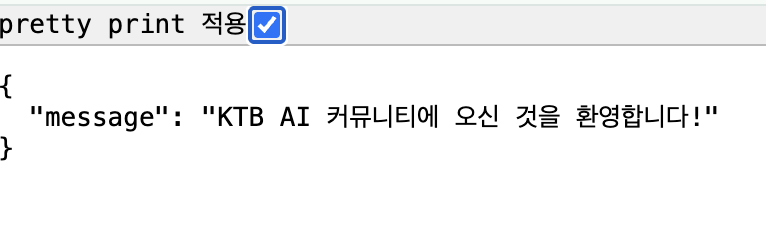

# Community Backend - FastAPI Learning Project

> FastAPI를 활용한 커뮤니티 백엔드 API 개발 학습 프로젝트

[](https://www.python.org/)
[](https://fastapi.tiangolo.com/)

[]()
[]()

추가 예정:
- **Database** | PostgreSQL, SQLAlchemy
- **Authentication** | JWT (JSON Web Token)
- **Security** | bcrypt, CORS, Rate Limiting
- **Validation** | Pydantic v2


[](https://kakaotechbootcamp.com/)
[](https://www.startupcode.kr/)
[](https://opensource.org/licenses/MIT)


## Table of Contents

[1. FastAPI 프로젝트 초기 설정 및 HTTP 기초](#1-fastapi-프로젝트-초기-설정-및-http-기초)
- [1-1. 설명](#1-1-설명)
- [1-2. 결과](#1-2-결과)
- [1-3. 문제](#1-3-문제)
- [1-4. 해결](#1-4-해결)


---


## 1. FastAPI 프로젝트 초기 설정 및 HTTP 기초

### 1-1. 설명

**branch name:** `feature/init-setup`  
**구현 내용:**
1. `pyproject.toml`: 의존성, 프로젝트 메타데이터 정리 및 이해
2. `main.py`: FastAPI의 기본 구조 작성 - 엔드포인트 이해 및 데코레이터 활용법 학습
3. `main.py`: HTTP Response의 3요소 구현 - Status Code, Headers, Body
4. `main.py`: JSON 직렬화 - Python dict → JSON string, `JSONResponse`
5. `main.py`: Cookie를 통한 상태 관리 - HTTP의 Stateless 문제 및 쿠키 활용 이해

**검증:** Postman으로 `GET` 요청 후  Status Code, Headers, Cookie 확인


### 1-2. 결과
<details>
<summary>직접 테스트해보기</summary>

```
uvicorn main:app --reload
```
> - API 문서: http://localhost:8000/docs
> - Health Check: http://localhost:8000/
> - 커스텀 응답: http://localhost:8000/custom
</details>
<br>

1. `GET /`
    <details>
    <summary>[img] browser</summary>

    
    </details>

    <details>
    <summary>[img] Postman</summary>

    
    </details>
    <details>
    <summary>terminal output</summary>

    ```sh
    INFO:     Will watch for changes in these directories: ['/Users/yanni/Desktop/kkotech/BEproject']
    INFO:     Uvicorn running on http://127.0.0.1:8000 (Press CTRL+C to quit)
    INFO:     Started reloader process [3306] using WatchFiles
    INFO:     Started server process [3308]
    INFO:     Waiting for application startup.
    INFO:     Application startup complete.
    INFO:     127.0.0.1:51881 - "GET / HTTP/1.1" 200 OK
    ```
    </details><br>
    
2. `GET /custom`
    <details>
    <summary>[img] Postman</summary>

    
    </details>


### 1-3. 문제

<details>
<summary>1. Postman에서 Header를 찾을 수 없음.</summary>

</details>
<details>
<summary>2. Postman에서 Cookie setting을 모두 확인할 수 없음.</summary>

</details>
    


### 1-4. 해결

<details>
<summary>1. `curl` 사용</summary>

- 입력: `curl -v http://localhost:8000/custom`
- 출력:
    ```zsh
    * Host localhost:8000 was resolved.
    * IPv6: ::1
    * IPv4: 127.0.0.1
    * Trying 127.0.0.1:8000...
    * Connected to localhost (127.0.0.1) port 8000
    > GET /custom HTTP/1.1
    > Host: localhost:8000
    > User-Agent: curl/8.7.1
    > Accept: */*
    > 
    * Request completely sent off
    < HTTP/1.1 200 OK
    < date: Wed, 12 Nov 2025 01:11:25 GMT
    < server: uvicorn
    < kkotech-custom-header: MyValue
    < content-length: 36
    < content-type: application/json
    < set-cookie: session_id=abc123; Path=/; SameSite=lax
    < 
    * Connection #0 to host localhost left intact
    {"status":"success","data":"custom"}%
    ```
</details>
<details>
<summary>2. Developer Tools - Network</summary>

browser ➡️ Developer Tools ➡️ Network

</details>
